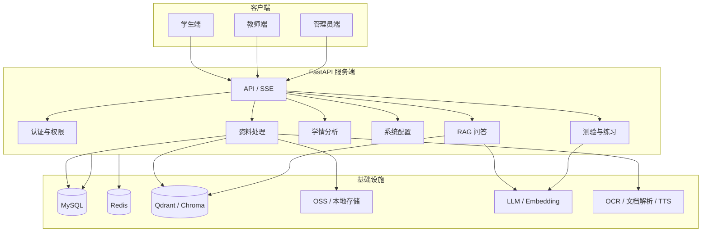

# 智学黑板 ClassAgent

面向教师、学生和管理员的 AI 原生课程学习平台。系统围绕教师上传的课程资料构建知识库，让学生可以按课程学习课件、提问、练习和复盘，教师可以管理资料、生成测验、查看学情，管理员可以统一配置模型、向量库、OCR、TTS、对象存储和系统服务。


## 核心定位

ClassAgent 不是通用聊天机器人，而是一个以课程资料为边界的智慧课堂系统。

学生问的不是通用大模型，而是“教师上传课件、教材、讲义和试卷形成的课程知识库”。系统会先理解问题，再生成检索关键词，检索课程资料，组织引用来源，最后生成教学化回答并记录学习信号。

核心流程：

```text
教师上传资料
  -> 文档解析 / OCR / 清洗
  -> 知识切片 / 向量化 / Qdrant 或 Chroma 入库
  -> 学生围绕课程提问
  -> 问题理解 / 检索词生成 / 向量检索 / 上下文组装
  -> AI 教学化回答 / 来源引用 / 问题记录
  -> 错题、薄弱点、练习和教师学情分析
```

## 一文件 Docker 部署

部署方只需要一个 `docker-compose.yml` 文件，不需要源码、不需要本地构建镜像。应用镜像由 GitHub Actions 在云端构建并推送到 GHCR。

镜像地址：

```text
ghcr.io/hjxwz123/classagent:latest
```

### 快速启动

```bash
curl -O https://raw.githubusercontent.com/hjxwz123/ClassAgent/main/docker-compose.yml
docker compose up -d
```

默认访问地址：

```text
http://localhost:8001
```

默认管理员：

```text
邮箱：admin@classagent.com
密码：Admin123456
```

首次正式部署建议至少替换端口、访问地址、系统密钥、数据库密码和默认管理员密码：

```bash
CLASSAGENT_APP_PORT=80 \
CLASSAGENT_PUBLIC_BASE_URL=http://your-domain.example.com \
CLASSAGENT_SECRET_KEY=replace-with-a-long-random-secret \
CLASSAGENT_MYSQL_ROOT_PASSWORD=replace-root-password \
CLASSAGENT_MYSQL_PASSWORD=replace-db-password \
CLASSAGENT_ADMIN_DEFAULT_PASSWORD=replace-admin-password \
docker compose up -d
```

### Docker Compose 包含的服务

| 服务 | 说明 |
| --- | --- |
| `app` | FastAPI 后端，同时托管构建后的 Vue 前端 |
| `worker` | Celery Worker，处理资料解析、题目生成等后台任务 |
| `mysql` | 业务数据库 |
| `redis` | Celery Broker / Result Backend |
| `qdrant` | 默认向量数据库 |

持久化数据使用 Docker volume：

```text
classagent_storage
classagent_mysql
classagent_redis
classagent_qdrant
```

### 常用 Docker 命令

```bash
# 查看服务状态
docker compose ps

# 查看应用日志
docker compose logs -f app

# 查看后台任务日志
docker compose logs -f worker

# 更新到最新云端镜像
docker compose pull
docker compose up -d

# 停止服务但保留数据卷
docker compose down

# 停止并删除数据卷，慎用
docker compose down -v
```

## 主要能力

### 学生端

- 加入课程并学习课件。
- 在课程范围内向 AI 提问，回答带来源引用。
- 在课件页内围绕当前页面追问。
- 输入题目或上传题图进行分步辅导。
- 参与教师发布的测验和练习。
- 查看错题、薄弱点、练习历史和学习记录。

### 教师端

- 创建课程、章节和课时。
- 上传课件、讲义、试卷等课程资料。
- 触发资料解析、切片、向量化和课时生成。
- 查看学生问答、错题、学习进度和班级掌握情况。
- 基于课程资料生成测验题目。
- 管理教学活动和教研内容。

### 管理员端

- 管理用户、角色、课程和系统配置。
- 配置聊天模型、任务模型、Embedding 模型。
- 配置 OCR、文档解析、TTS、OSS、向量数据库等服务。
- 查看服务健康状态、日志、备份和运行数据。

## 智慧课堂 Agent

ClassAgent 的问答模块按教学场景设计，不直接把学生原问题当作唯一检索文本。

典型处理流程：

```text
接收学生问题
  -> 判断课程权限和上下文
  -> 理解问题类型
  -> 使用任务模型生成检索关键词
  -> 按课程、章节、课件页范围检索向量库
  -> 结果重排和上下文组装
  -> 调用回答模型生成教学化解释
  -> 返回来源引用和继续追问选项
  -> 记录学生问题和学习信号
```

支持的问题类型包括：

- 概念解释：例如“什么是霍夫曼编码？”
- 原理说明：例如“LZW 为什么是无损压缩？”
- 对比问题：例如“JPEG 和 PNG 有什么区别？”
- 章节总结：例如“第五章讲了什么？”
- 大范围学习：先给框架和小节摘要，再引导逐步展开。
- 表格问题：定位资料中的表格并抽取结构化内容。
- 练习生成：根据课程、章节、知识点或薄弱点出题。
- 复习整理：生成笔记、知识点清单和复习建议。

回答规则：

- 优先基于教师上传资料回答。
- 找到依据时必须返回文件名、章节、页码或幻灯片编号。
- 课件中没有明确内容时说明“不在当前课程资料中”，不编造来源。
- 大章节内容按“章节总览 -> 小节摘要 -> 页级展开”分层输出。

## 系统架构



## 技术栈

| 层级 | 技术 |
| --- | --- |
| 前端 | Vue 3、TypeScript、Vite、Vue Router、Pinia、ECharts、KaTeX |
| 后端 | Python 3.12、FastAPI、Uvicorn、SQLAlchemy、Pydantic |
| 异步任务 | Celery、Redis |
| 数据库 | MySQL |
| 向量库 | Qdrant、Chroma |
| AI 能力 | LLM、Embedding、OCR、文档解析、TTS |
| 部署 | Docker、Docker Compose、GitHub Actions、GHCR |

## 目录结构

```text
.
├── app/                         # FastAPI 后端
│   ├── api/routes/              # auth、courses、qa、learning、teacher、admin 等接口
│   ├── core/                    # 配置、安全、依赖、响应、错误处理
│   ├── db/                      # SQLAlchemy 模型和数据库会话
│   ├── schemas/                 # Pydantic 请求/响应结构
│   ├── services/                # AI、RAG、资料、学习、学情、存储等业务服务
│   └── tasks/                   # Celery 异步任务
├── frontend/                    # Vue 前端
│   ├── src/components/          # 通用组件
│   ├── src/router/              # 路由与角色入口
│   ├── src/stores/              # Pinia 状态
│   ├── src/styles/              # 设计变量和页面样式
│   └── src/views/               # 首页、学生端、教师端、管理员端
├── miniprogram/                 # 小程序端
├── tests/                       # 后端测试
├── Dockerfile                   # 云端镜像构建文件
├── docker-compose.yml           # 一文件部署配置
├── pyproject.toml               # 后端依赖和工具配置
└── README.md
```

## 本地开发

本地开发适合调试代码。正式给别人部署时建议使用上面的 Docker Compose 一文件部署。

### 环境要求

- Python 3.12+
- Node.js 20+
- MySQL 8+
- Redis 6+
- 可选：Qdrant、OCR、文档解析、TTS、OSS、外部大模型服务

### 后端

```bash
python3 -m venv .venv
. .venv/bin/activate
pip install -e '.[dev]'

cp .env.example .env
uvicorn app.main:create_app --factory --host 0.0.0.0 --port 8000
```

健康检查：

```bash
curl http://127.0.0.1:8000/api/v1/health
```

### 前端

```bash
cd frontend
npm install
npm run dev -- --host 0.0.0.0 --port 5173 --strictPort
```

开发访问：

```text
http://127.0.0.1:5173
```

生产构建：

```bash
cd frontend
npm run build
```

构建产物会输出到 `frontend/dist`。Docker 镜像中后端会直接托管该目录，因此容器部署时前后端同源访问。

## 环境变量

### Docker Compose 变量

`docker-compose.yml` 使用 `CLASSAGENT_` 前缀，避免被项目本地 `.env` 误覆盖。

| 变量 | 默认值 | 说明 |
| --- | --- | --- |
| `CLASSAGENT_IMAGE` | `ghcr.io/hjxwz123/classagent:latest` | 应用镜像 |
| `CLASSAGENT_APP_PORT` | `8001` | 宿主机访问端口 |
| `CLASSAGENT_PUBLIC_BASE_URL` | `http://localhost:${CLASSAGENT_APP_PORT}` | 外部访问地址 |
| `CLASSAGENT_SECRET_KEY` | `replace-with-a-long-random-secret` | 生产必须替换 |
| `CLASSAGENT_MYSQL_DATABASE` | `class_agent` | MySQL 数据库 |
| `CLASSAGENT_MYSQL_USER` | `class_agent` | MySQL 用户 |
| `CLASSAGENT_MYSQL_PASSWORD` | `class_agent_2026` | MySQL 密码，生产必须替换 |
| `CLASSAGENT_MYSQL_ROOT_PASSWORD` | `root_password` | MySQL root 密码，生产必须替换 |
| `CLASSAGENT_ADMIN_DEFAULT_EMAIL` | `admin@classagent.com` | 默认管理员邮箱 |
| `CLASSAGENT_ADMIN_DEFAULT_PASSWORD` | `Admin123456` | 默认管理员密码，生产必须替换 |
| `CLASSAGENT_EMBEDDING_DIMENSION` | `1536` | Embedding 维度 |

### 后端 `.env` 变量

本地开发时从 `.env.example` 复制：

| 变量 | 说明 |
| --- | --- |
| `APP_ENV` | `development`、`test` 或 `production` |
| `SECRET_KEY` | JWT 签名密钥 |
| `DATABASE_URL` | SQLAlchemy 数据库连接串 |
| `REDIS_URL` | Redis 连接串 |
| `CELERY_BROKER_URL` | Celery Broker |
| `CELERY_RESULT_BACKEND` | Celery 结果后端 |
| `CELERY_TASK_ALWAYS_EAGER` | 是否同步执行 Celery 任务，生产必须为 `false` |
| `PUBLIC_BASE_URL` | 外部访问基础地址 |
| `VECTOR_STORE_PROVIDER` | `chroma` 或 `qdrant` |
| `CHROMA_PERSIST_DIR` | Chroma 本地持久化目录 |
| `QDRANT_URL` | Qdrant 服务地址，支持 `http://...` 或 `local:...` |
| `QDRANT_COLLECTION_PREFIX` | Qdrant collection 前缀 |
| `EMBEDDING_DIMENSION` | Embedding 维度 |
| `EXTERNAL_AI_MODE` | 外部 AI 服务模式，`auto` 或 `strict` |
| `EXTERNAL_STORAGE_MODE` | 外部存储模式，`auto`、`local` 或 `oss` |

## API 模块

所有版本化接口挂载在：

```text
/api/v1
```

主要模块：

- `/auth`：登录、注册、当前用户、认证状态。
- `/courses`：课程、章节、成员关系。
- `/materials`：资料上传、解析状态、预览、重建索引。
- `/learning`：课时、课件页、学习进度、练习。
- `/qa`：课程问答、课件页问答、历史、收藏、反馈、来源。
- `/tutoring`：题目辅导、图片题确认、分步讲解。
- `/student`：学生首页、档案、计划、错题和学习数据。
- `/teacher`：教师课程、资料、课时、测验、学情。
- `/admin`：用户、课程、模型、服务配置、日志、备份、健康状态。
- `/analytics`：统计和分析能力。
- `/health`：健康检查。

## 常用命令

```bash
# 后端测试
.venv/bin/pytest

# RAG / AI / 向量库相关测试
.venv/bin/python -m pytest tests/test_qa_agent_helpers.py tests/test_ai_service.py tests/test_vector_store.py -q

# 生产配置校验测试
.venv/bin/python -m pytest tests/test_production_config.py -q

# 前端构建
cd frontend
npm run build

# Docker Compose 配置展开校验
docker compose config
```

## 部署与安全建议

- 生产环境必须替换 `SECRET_KEY`、数据库密码和默认管理员密码。
- 不要提交 `.env`、数据库备份、对象存储密钥、模型 API Key 或上传资料。
- 对外部署建议配置 HTTPS，并在反向代理中设置上传大小限制。
- SSE 问答流式接口需要关闭代理缓冲或为对应路径单独配置。
- 上传资料、解析产物、向量数据和日志属于业务数据，应按学校或机构边界隔离。
- Qdrant collection 前缀建议按环境区分，避免测试和生产数据混用。
- 管理员端建议限制访问来源，并定期轮换模型和云服务密钥。

## 字体与前端资源

首页使用自托管字体子集以保证显示一致。字体来源于 Google Fonts，授权为 SIL Open Font License 1.1，相关 license 文件位于：

```text
frontend/src/assets/fonts/home
```

## 项目状态

ClassAgent 当前聚焦教学闭环和私有化部署场景，适合用于：

- AI 课程学习平台原型。
- 校园内部智能学习系统。
- 教师教研与学生自学一体化工具。
- 课程资料 RAG 与学习数据分析实践。

## 许可证

当前仓库未附带统一开源许可证。如需商用、二次分发或公开部署，请先确认项目授权范围以及所接入第三方服务的使用条款。


