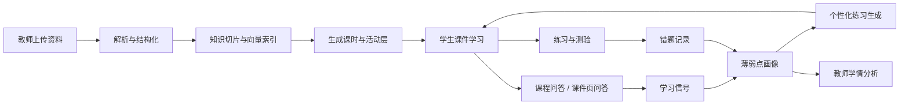
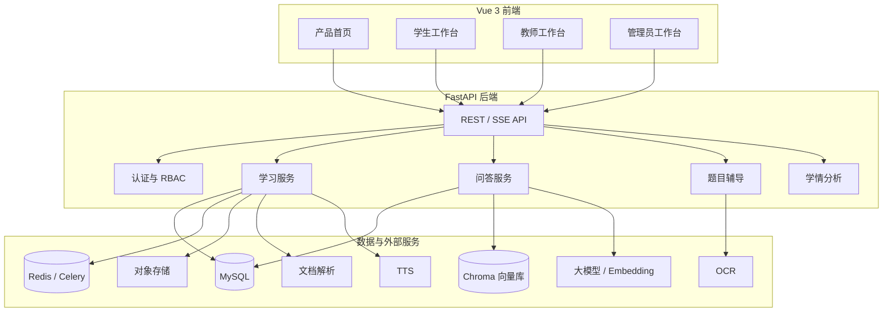

# 智学黑板 ClassAgent

> 面向学校、教师与学生的 AI 原生课程学习平台。
> 把课本、课件、试卷、错题和课堂数据组织成可检索、可提问、可练习、可追踪的智能学习工作台。


## 项目定位

智学黑板不是单一聊天机器人，也不是简单的课件播放器。它以“课程”为核心边界，将教学资料解析、课时生成、沉浸式学习、课程问答、题目辅导、错题归因、薄弱点追踪、练习生成和教师学情分析串成一条闭环。

系统提供三类工作台：

- **学生工作台**：学习课件、按课程提问、拍照问题、练习测验、错题复盘、薄弱点强化和学习计划。
- **教师工作台**：管理课程资料、生成课时、审核讲稿、配置活动层、出题测验、查看班级学情和提醒学生。
- **管理员工作台**：管理用户、课程、模型、Embedding、对象存储、OCR、文档解析、TTS 和系统运行状态。

## 功能亮点

### 1. 课程资料智能中枢

- 支持围绕课程上传教材、讲义、课件、试卷和补充资料。
- 后端对资料进行解析、切片、向量化和结构化入库。
- 检索范围以课程为边界，避免不同课程之间的知识串扰。
- 支持课程、章节、课时、课件页多层上下文组织。

### 2. 沉浸式课件学习

- 学生端提供类似黑板/课件播放的沉浸式 lesson 页面。
- 课件页支持正文、文稿、活动、笔记和问答区域。
- 左右学习区域可拖动调整宽度，课件展示区与交互区自适应变化。
- 支持课件页缩略图、页码导航、字幕隐藏、音频播放和学习进度记录。
- 课件页问答会保留当前课件页上下文，适合追问“这一页”“这个概念”“这道题”。

### 3. 课程 AI 问答

- `/qa` 提供课程范围内的全局问答。
- 支持多轮对话、历史记录、收藏、反馈、思考过程展示和引用来源。
- 支持图片上传与 OCR，学生可以对题目截图、作业图片和讲义片段直接提问。
- 全局 QA 与课件页 QA 隔离：课程问答历史不会混入课件学习页面的对话记录。
- 课件页 QA 会保存为学习信号，但不会污染全局 QA 抽屉。

### 4. 题目辅导与错题闭环

- 学生可以输入题目或上传图片创建题目辅导记录。
- 系统按“读题、思路、步骤、答案、变式”组织辅导过程。
- 错题本记录错因、状态、知识点、掌握情况和复习动作。
- 支持从错题与薄弱点生成针对性练习。

### 5. 薄弱点学习信号

- 学生做错题会形成显式薄弱点。
- 学生在 QA 中询问题目、概念、知识点，也会形成学习信号。
- 系统综合错题次数、问答信号和知识点匹配，生成 `weak_score`。
- 当选择“根据薄弱点出题”时，系统会优先使用薄弱点与学习信号更强的知识点来组织题目。

### 6. 练习、测验与个性化训练

- 支持按课程、章节、知识点、错题和薄弱点生成练习。
- 支持教师发布测验，学生在线答题。
- 客观题可自动批改，结果进入学习记录和分析数据。
- 学生端提供练习历史、考试答题页、题号导航和结果反馈。

### 7. 教师教研工作流

- 创建课程、章节和资料库。
- 上传资料后触发解析、切片、向量化和课时生成。
- 审核课时内容、课件页、讲稿、活动层和音频。
- 发布课堂测验和弱点练习。
- 查看学生学习进度、错题分布、问答记录和班级掌握度。

### 8. 管理员与服务配置

- 用户、角色、课程、资料和系统配置管理。
- 支持配置多类 AI 服务：聊天模型、Embedding、OCR、文档解析、TTS、对象存储。
- 提供服务健康状态、日志、备份和运行监控入口。
- 适合学校或机构进行私有化部署，核心数据留在本地环境。

## 角色功能矩阵

| 模块 | 学生 | 教师 | 管理员 |
| --- | --- | --- | --- |
| 课程加入与学习 | 加入课程、学习课件、记录进度 | 创建和维护课程 | 管理课程数据 |
| 资料解析 | 使用解析结果问答与学习 | 上传资料、触发解析 | 配置解析服务 |
| AI 问答 | 课程问答、课件页问答、图片问答 | 查看学习问答与学情 | 配置模型与密钥 |
| 课件学习 | 播放课件、笔记、字幕、音频 | 生成和审核课件 | 管理生成服务 |
| 错题与辅导 | 错题本、题目辅导、复习 | 查看错题分布 | 数据审计 |
| 薄弱点 | 查看弱点、按弱点练习 | 班级弱点分析 | 系统策略配置 |
| 测验练习 | 在线练习与考试 | 发布测验、查看结果 | 课程与权限管理 |
| 系统运维 | - | - | 模型、OSS、OCR、TTS、日志、备份 |

## AI 学习闭环



## 系统架构



## 技术栈

### 后端

- Python 3.12
- FastAPI / Uvicorn
- SQLAlchemy 2.x
- Pydantic / Pydantic Settings
- MySQL
- Redis / Celery
- ChromaDB
- AI 服务、Embedding、OCR、DocMind、TTS、OSS 适配层

### 前端

- Vue 3
- TypeScript
- Vite
- Vue Router
- Pinia
- ECharts
- KaTeX
- Markdown-it
- lucide-vue-next

### AI 与内容处理

- 课程资料解析与文本抽取
- 知识切片与向量检索
- RAG 课程问答
- 多轮问答历史改写
- OCR 图片题识别
- 课时讲稿与活动层生成
- TTS 音频合成
- 学习信号与薄弱点推断

## 目录结构

```text
.
├── app/                         # FastAPI 后端
│   ├── api/routes/              # auth、courses、qa、learning、teacher、admin 等接口
│   ├── core/                    # 配置、安全、依赖、响应、错误处理
│   ├── db/                      # SQLAlchemy 模型和数据库会话
│   ├── schemas/                 # Pydantic 请求/响应结构
│   ├── services/                # AI、问答、学习、资料、存储、分析等业务服务
│   └── tasks/                   # Celery 异步任务
├── frontend/                    # Vue 前端
│   ├── src/assets/              # 字体和静态资源
│   ├── src/components/          # 通用组件
│   ├── src/router/              # 路由与角色入口
│   ├── src/stores/              # Pinia 状态
│   ├── src/styles/              # 设计变量和页面样式
│   └── src/views/               # 首页、学生端、教师端、管理员端
├── docs/                        # 文档与接口说明
├── scripts/                     # 运维与辅助脚本
├── storage/                     # 本地运行时存储，生产环境建议迁移到对象存储
├── tests/                       # 后端测试
├── pyproject.toml               # 后端依赖和工具配置
└── README.md
```

## 快速开始

### 环境要求

- Python 3.12+
- Node.js 20+
- MySQL 8+
- Redis 6+
- 可选：对象存储、OCR、文档解析、TTS、外部大模型服务

### 后端启动

```bash
python3 -m venv .venv
. .venv/bin/activate
pip install -e '.[dev]'

cp .env.example .env
uvicorn app.main:create_app --factory --host 0.0.0.0 --port 8000
```

健康检查：

```bash
curl http://127.0.0.1:8000/api/v1/health
```

### 前端启动

```bash
cd frontend
npm install
npm run dev -- --host 0.0.0.0 --port 5173 --strictPort
```

访问：

```text
http://127.0.0.1:5173
```

### 生产构建

```bash
cd frontend
npm run build
```

构建产物输出到：

```text
frontend/dist
```

## 核心环境变量

运行配置从 `.env` 读取。建议从 `.env.example` 复制后按环境修改。

| 变量 | 说明 |
| --- | --- |
| `APP_ENV` | 运行环境 |
| `SECRET_KEY` | 后端签名密钥，生产环境必须替换 |
| `DATABASE_URL` | MySQL 连接串 |
| `REDIS_URL` | Redis 连接串 |
| `CELERY_BROKER_URL` | Celery Broker |
| `CELERY_RESULT_BACKEND` | Celery 结果后端 |
| `PUBLIC_BASE_URL` | 外部访问基础地址 |
| `CHROMA_PERSIST_DIR` | 向量库持久化目录 |
| `EMBEDDING_DIMENSION` | Embedding 维度 |
| `EXTERNAL_AI_MODE` | 外部 AI 服务模式 |
| `EXTERNAL_STORAGE_MODE` | 外部存储模式 |
| `ADMIN_DEFAULT_EMAIL` | 默认管理员邮箱 |
| `ADMIN_DEFAULT_PASSWORD` | 默认管理员密码 |
| `ADMIN_DEFAULT_NAME` | 默认管理员名称 |

生产环境需要替换默认管理员、密钥、数据库账号、模型密钥和外部服务密钥。

## 常用命令

```bash
# 后端测试
.venv/bin/pytest

# 只运行学习核心流程相关测试
.venv/bin/pytest tests/test_m3_m6_learning_flow.py

# 前端生产构建
cd frontend
npm run build

# 前端预览
cd frontend
npm run preview
```

## API 模块

所有版本化接口挂载在：

```text
/api/v1
```

主要模块：

- `/auth`：登录、当前用户、认证状态
- `/courses`：课程、章节、成员关系
- `/materials`：资料上传、解析状态、预览
- `/learning`：课时、课件页、学习进度、练习
- `/qa`：课程问答、课件页问答、图片附件、历史、收藏、反馈
- `/tutoring`：题目辅导、图片题确认、分步讲解
- `/student`：学生首页、档案、计划、错题和学习数据
- `/teacher`：教师课程、资料、课时、测验、学情
- `/admin`：用户、课程、模型、服务配置、监控、日志、备份
- `/analytics`：统计和分析能力
- `/health`：健康检查

## 部署建议

- 使用 MySQL 和 Redis 作为基础服务。
- 上传文件、生成音频、解析产物和日志建议接入对象存储或独立持久化卷。
- 向量库目录需要随环境隔离，避免测试和生产数据混用。
- 后端建议放在反向代理后，并配置 HTTPS、上传大小限制和长连接超时。
- SSE 问答流式接口需要关闭代理缓冲或为对应路径单独配置。
- 管理员端应限制访问来源，并定期轮换模型和云服务密钥。

## 安全说明

- 不要在仓库中提交 `.env`、数据库备份、对象存储密钥或模型 API Key。
- 生产环境必须更换默认管理员账号和 `SECRET_KEY`。
- 上传资料、课件生成文件、向量数据和运行日志属于业务数据，应按学校或机构边界隔离。
- 如需对外开放学生入口，建议配置 HTTPS、强密码策略和访问审计。

## 字体与前端资源

首页为保证现代浏览器显示一致，使用自托管字体子集。字体来源于 Google Fonts，授权为 SIL Open Font License 1.1，相关 license 文件保存在：

```text
frontend/src/assets/fonts/home
```

## 项目状态

ClassAgent 当前聚焦教学闭环和私有化部署场景，适合用于：

- AI 课程学习平台原型
- 校园内部智能学习系统
- 教师教研与学生自学一体化工具
- 课程资料 RAG 与学习数据分析实践

## 许可证

当前仓库未附带统一开源许可证。如需商用、二次分发或公开部署，请先确认项目授权范围以及所接入第三方服务的使用条款。
